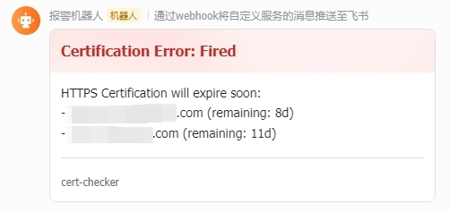

# Certificate Sentry

Check the validity period of the domain name's HTTPS certificate and trigger a Lark alarm when it is close to expiration.

检查域名的 HTTPS 证书有效期，临近过期时触发飞书报警。



## Config

```yaml
# Domain list to check.
domains:
  - google.com
  - github.com

alert:
  # The threshold for triggering alert.
  beforeExpired: 14d
  # The hook URL of Lark(FeiShu) robot.
  notifyUrl: https://open.feishu.cn/open-apis/bot/v2/hook/xxxx
```

## Run with Docker

```sh
docker run -d --restart unless-stopped \
  --volume ./myconfig.yaml:/etc/config.yaml \
  panjiang/certificate-sentry \
  -config=/etc/config.yaml
```

## Run with Docker Compose

```yaml
services:
  certificate-sentry:
    container_name: certificate-sentry
    image: panjiang/certificate-sentry
    restart: unless-stopped
    volumes:
      - ./myconfig.yaml:/etc/config.yaml
    command: ["-config=/etc/config.yaml"]
```
